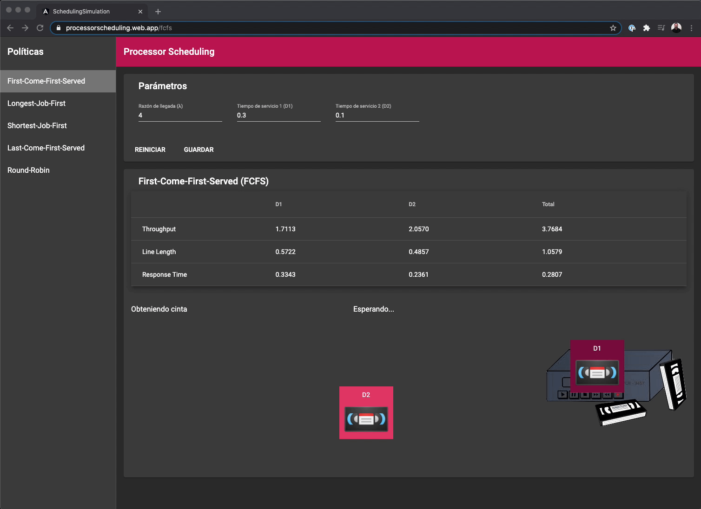

# Processor Scheduling Simulation

Este simulador es parte del proyecto del curso de Analisis de Rendimiento del Posgrado en Redes de la [Universidad Galileo](https://www.galileo.edu/).

Las politicas implementadas en este simulador estan basadas en el capitulo 3 (Processor Scheduling) del libro [P.S. to Operating Systems](https://www.amazon.com/P-S-Operating-Systems-Larry-Dowdy/dp/0130116858).

Pueden ver una demostracion en vivo en [processorscheduling.web.app](https://processorscheduling.web.app/fcfs).



## Desarrollo

Para correr el simulador en tu computadora, puedes clonar este repositorio. Necesitas tener la ultima version instalada de [NodeJS](https://nodejs.org/en/download/).
``` bash
npm install     # install dependencias

npm run start   # inicia un servidor de desarrollo
```

Navega a `http://localhost:4200/`. La aplicaction automaticamente recargara cuando realices un cambio en los archivos fuente.

